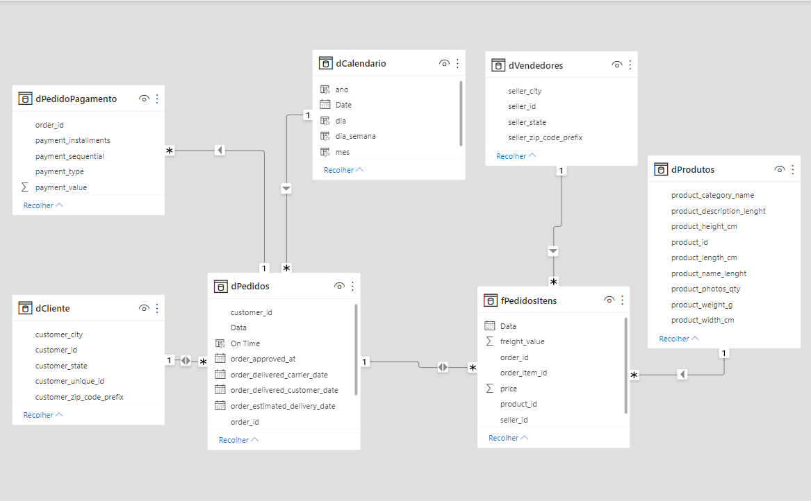

# Análise de dados de um e-commerce

---

## **Introdução do Problema**

Este projeto foi desenvolvido no curso de DATA INSIGHTS da FLAI, escola de inteligência artificial e ciência de dados.

Trata-se da análise de dados de uma empresa de e-commerce utilizando a ferramenta da Microsoft POWER BI.

A análise de dados é realizada construindo-se GRÁFICOS e MEDIDAS com fórmulas DAX e linguagem M. 

**Problema**: Identificar e reportar em forma de dashboard as informações mais relevantes do e-commerce Olist do ponto de vista das Finanças e da Logística. 

**Dataset**: Dados foram extraídos do Kaggle do e-commerce Olist:

* Link dos dados da Olist: https://www.kaggle.com/datasets/olistbr/brazilian-ecommerce

## **Desenvolvimento**

Para o desenvolvimento do dashboard, utilizei os dados das seguintes tabelas fornecidos pela Olist: 
* Aqui podemos ver as tabelas e seus relacionamentos. Foram definidos as Cardinalidade dos relacionamento conforme as regras de negócio bem como o tipo de fluxo de dados entre elas!

* Foi necessário fazer o ETL dos dados tratando dados Nulos, Outliers(exceções) e convertendo os Tipos dos dados para que possam finalmente serem manipulados e compreendidos na análise de dados.

* No Dashboard "Finanças", analisamos os dados do ponto de vista financeiro:

* No Dashboard "Logística", analisamos os dados do ponto de vista das encomendas e entregas dos produtos:

## **Conclusão**

Principais conclusões que podemos extrair dos Dashboard:

* A principal forma de pagamento é por cartão de crédito.

* Produtos da categoria "beleza_saúde" são os que mais tem demanda.

* Período de março à agosto o volume de vendas são maiores.

* Em setembro existe uma queda acentuada nas vendas.

* A região/estado com maior volume de operações.

* A taxa de encomendas entregues no prazo que é de 92,85%.

**CLICK: ** [Para interagir com o  dashboard no Power BI](https://app.powerbi.com/view?r=eyJrIjoiNWEwZDJmOGMtYjE3OS00ZWRjLTg5ZWMtOThmMWRlYWMzY2E4IiwidCI6IjZkYmExZDM2LTUwYTItNDRlMC04NDFkLTVjODliYjlhNDFlMCJ9&pageName=ReportSectionb9db0aeb7739ba08d78e)
